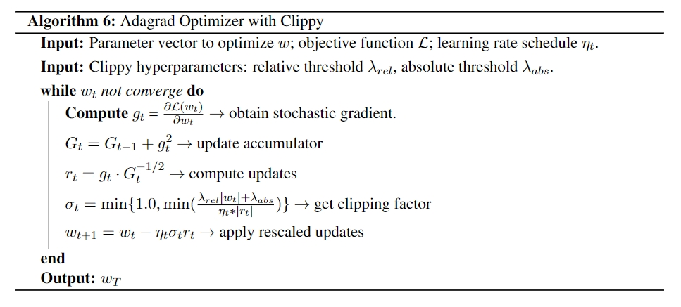
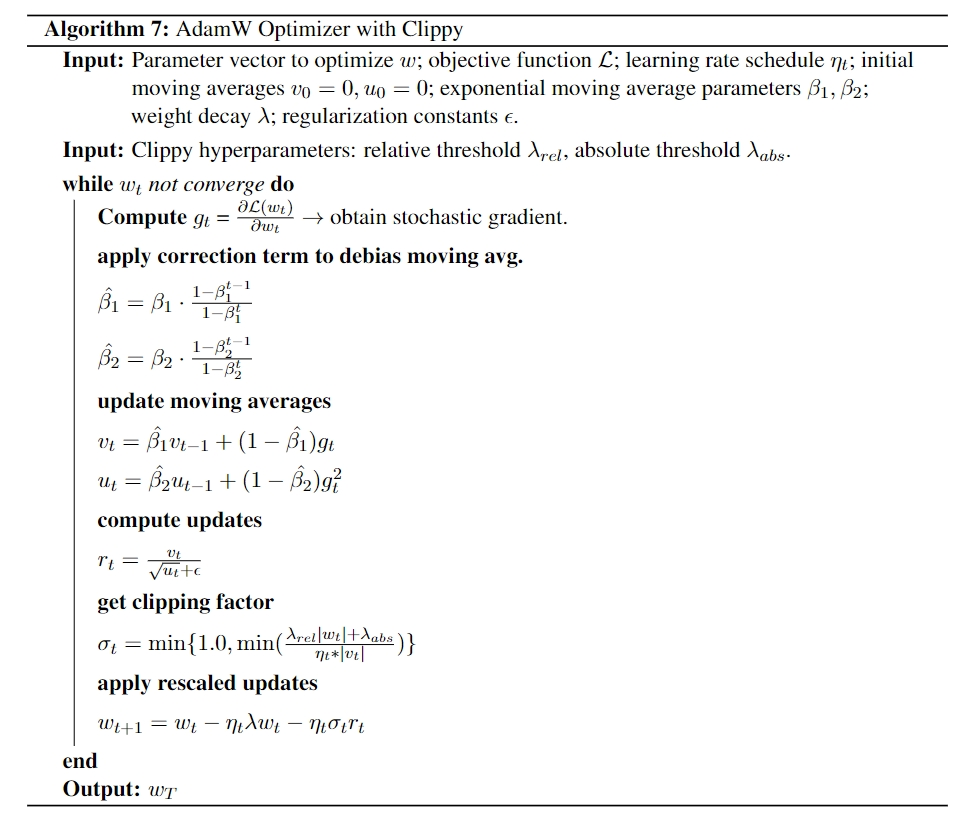

# AdamW and AdaGrad Optimizers with Clippy

This repository contains a PyTorch implementation of the ClippyAdamW optimizer, referencing the [Clippy](https://arxiv.org/abs/2302.09178) and [StableAdamW](https://proceedings.neurips.cc/paper_files/paper/2023/file/20bd42d82998bc61732c00452228e814-Paper-Conference.pdf). 

Clippy is a method developed by Google to address the training instability problem they faced when training large deep learning models for recommender systems on YouTube data.

According to the paper:

*"Clippy offers larger gains when the model is more complex and trained with a larger learning rate."*

*"It has shown significant improvements on training stability in multiple ranking models for YouTube recommendations and is productionized in some large and complex models."*

## AdaGrad with Clippy

**Pseudocode of ClippyAdaGrad**:

- `clippy_adagrad_tf.py` - ClippyAdaGrad optimizer implementation in TensorFlow. The original [ClippyAdagrad](https://dl.acm.org/doi/pdf/10.1145/3580305.3599846) is implemented in this file.
- `clippy_adagrad_test_tf.py` - The original test file for `clippy_adagrad_tf.py`.
- `clippy_adagrad_pytorch.py` - ClippyAdaGrad optimizer implementation in PyTorch. Modified by me to work with PyTorch.
- `clippy_adagrad_test_pytorch.py` - Test file for `clippy_adagrad_pytorch.py`. Reference to the `clippy_adagrad_test_tf.py`.
- `clippyadagrad.py` - The implementation in PyTorch by the [clippy-adagrad](https://github.com/ledmaster/clippy-adagrad) repo.

## AdamW with Clippy

**Pseudocode of ClippyAdamW**:

- `clippy_adamw.py` - ClippyAdamW optimizer implementation in PyTorch. Implemented by me to work with PyTorch.
- `stableadamwunfused.py` - The original implementation of StableAdamW optimizer in PyTorch. Implemented by [StableAdamW](https://gist.github.com/mitchellnw/d42e22a0b9ec02ceaf4f7b4457f51423).

